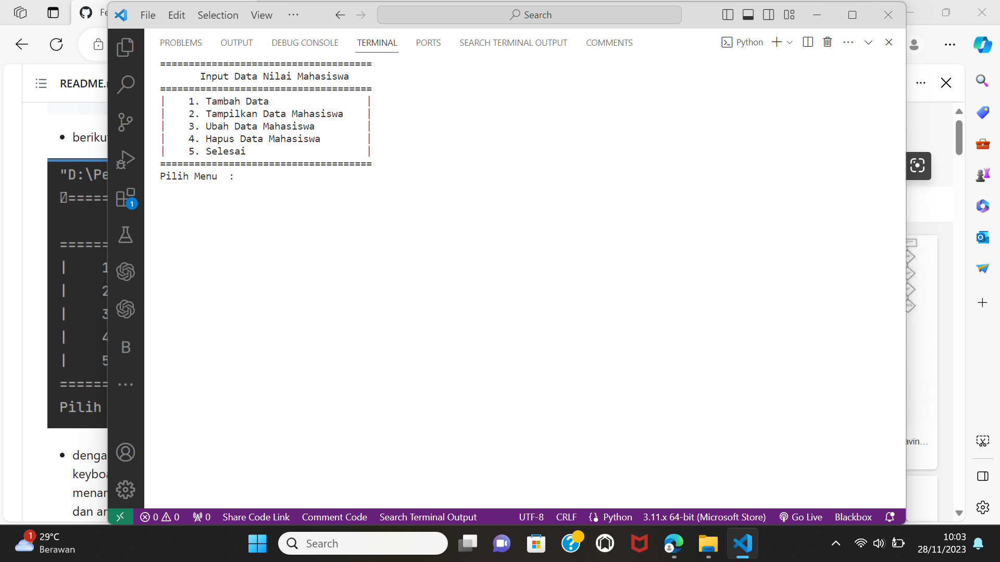

# lab-6
# Fakhri Afif M.
# 312310632
# TI.23.A6
<br>Repository ini adalah isi praktikum dalam penggunaan function pada python
# Pada repository Lab 6 ini, saya akan menjelaskan hasil praktikum mengenai penggunaan function didalam python berikut dengan flowchartnya.
Di bawah ini adalah flowchart progaramnya 

<br>Dibawah ini adalah code untuk meng-import, karena kita akan gunakan system, untuk mendapatkan clear screen yang ada dalam system os, jika kita perhatikan, disetiap function yang kita buat, terdapat syntax ``system('cls')``
syntax tersebut lah yang kita gunakan dalam hal import system ini. maka kita import terlebih dahulu, berikut code nya:
``` python
from os import system
```
Dibawah ini code untuk membuat list yang akan kita gunakan, karena program yang akan kita buat adalah program daftar nilai mahasiswa, maka kita buat terlebih dahulu list nya

``` python
s_nama = []
s_nim = []
s_tugas = []
s_uts = []
s_uas = []
s_akhir = []
 ```

<br>Dibawah ini code untuk membuat fungsi judul, karena didalam fungsi, kita dapat memanggil fungsi tersebut berkali-kali tanpa harus mengulang codingannya, hanya perlu dengan cara memanggil fungsi ( contohnya: fungsi() ), setiap kita akan membuat fungsi, maka harus di awali dengan ``def`` dan diikuti dengan nama fungsi yang akan kita buat dan gunakan selanjutnya.
``` python
def judul():
    print('==================================')
    print('|     Daftar Nilai Mahasiswa     |')
    print('==================================')
```
di bawah adalah code untuk membuat fungsi menu
```python
def menu():
    system('cls')
    print('=====================================')
    print('Input Data Nilai Mahasiswa'.center(40))
    print('=====================================')
    print('|    1. Tambah Data                 |')
    print('|    2. Tampilkan Data Mahasiswa    |')
    print('|    3. Ubah Data Mahasiswa         |')
    print('|    4. Hapus Data Mahasiswa        |')
    print('|    5. Selesai                     |')
    print('=====================================')
    choose = input('Pilih Menu  : ')
    if choose == '1':
        tambah()
    elif choose == '2':
        tampilkan()
    elif choose == '3':
        ubah()
    elif choose == '4':
        hapus()
    elif choose == '5':
        selesai()
    else:
        tidak = input('Menu Tidak Ada')
        system('cls')
        menu()
```
berikut tampilan ketika program di jalankan 

dengan ketentuan jika kita menekan angka 1 pada keyboard, maka akan menambah data, dan angka 2 akan menampilkan data, angka 3 akan meng-ubah data (nama), dan angka 4 akan menghapus data yang kita inginkan

<br>code dibawah untuk membuat fungsi tambah yang ada dalam program ini
``` python
def tambah():
    system('cls')
    judul()
    print('Tambah Data'.center(40))
    print('==================================')
    nama = input('Nama     : ')
    s_nama.append(nama)
    nim = input('NIM       : ')
    s_nim.append(nim)

    system('cls')
    judul()
    print('Tambah Data'.center(40))
    print('==================================')
    tugas = float(input('Nilai Tugas    : '))
    s_tugas.append(tugas)

    uts = float(input('Nilai UTS        : '))
    s_uts.append(uts)

    uas = float(input('Nilai UAS        : '))
    s_uas.append(uas)

    total = tugas * 0.30 + uts * 0.35 + uas * 0.35
    s_akhir.append(total)
    print('Data Tersimpan'.center(40))
    kembali = input('Kembali [Enter]')
    menu()
```
